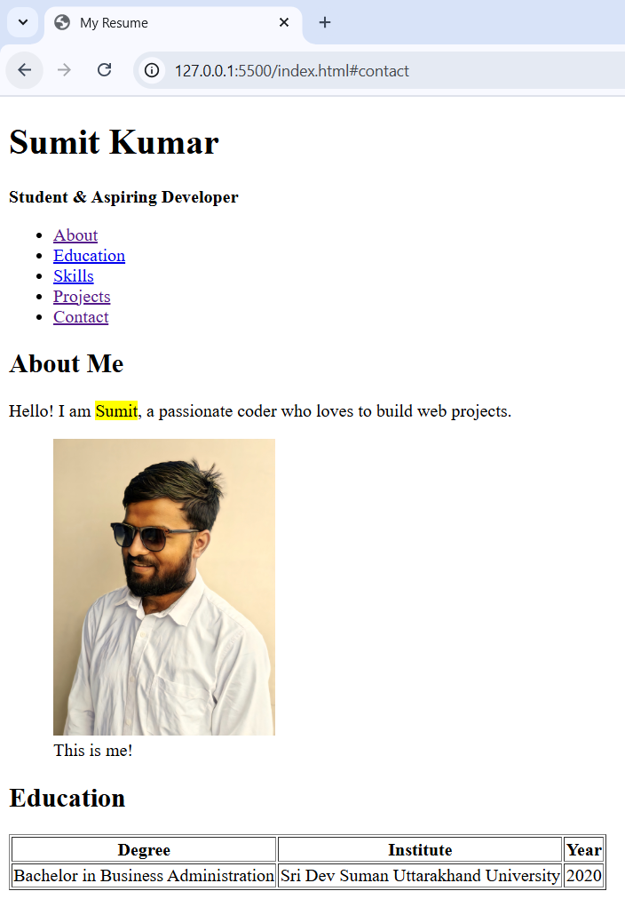
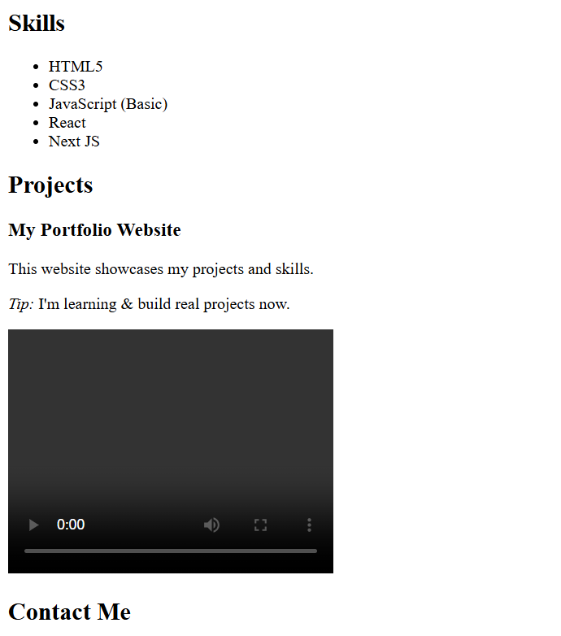
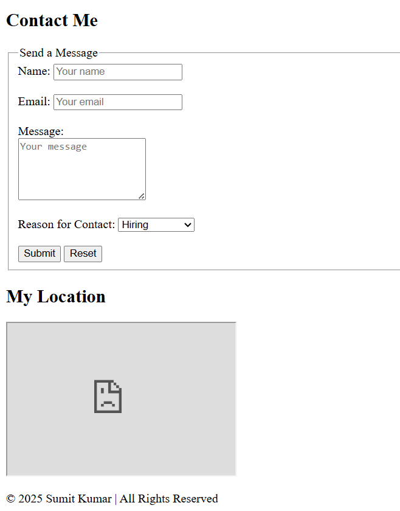

# 🧪 HTML Resume Practice Project

This is a **beginner-friendly practice project** where I created a resume-style webpage using only HTML.  
It helped me revise and understand important concepts of HTML5 including:

---

## ✨ What I Practiced in This Project

- Basic page structure using `<!DOCTYPE html>`, `<html>`, `<head>`, and `<body>`
- Semantic tags like `<header>`, `<main>`, `<section>`, `<footer>`, `<nav>`, `<article>`, `<aside>`, and `<figure>`
- Useful attributes like `alt`, `href`, `title`, `src`, `datetime`, `required`, and `placeholder`
- Form elements: `<form>`, `<fieldset>`, `<label>`, `<input>`, `<select>`, `<textarea>`, `<button>`
- Table with `<thead>`, `<tbody>`, `<th>`, `<td>`
- Media elements like `<video>`, `<iframe>`
- Practical usage of links, list, headings, and image

---

## 🎯 Purpose

I made this to **revise and memorize HTML tags** and get comfortable writing clean and structured HTML code.  
It is **not a portfolio** or real-world project, but a personal hands-on HTML revision file.  
The idea was to bring most HTML elements together in one file, so I can revise them later too.

---

## 🔧 Tech Stack

- HTML5 (pure, no CSS/JS)

---

## 📸 Screenshots

Below are the screenshots used as visual reference during practice:

### Screenshot 1

### Screenshot 2

### Screenshot 3

## ✅ Status

🟢 Completed basic revision  

---

## 📬 Contact

If you'd like to give feedback or collaborate in future learning projects:

- 📧 Email: **sumitnandan2025@gmail.com**
- 📌 GitHub: [sumitnandan2411](https://github.com/sumitnandan2411)

---

